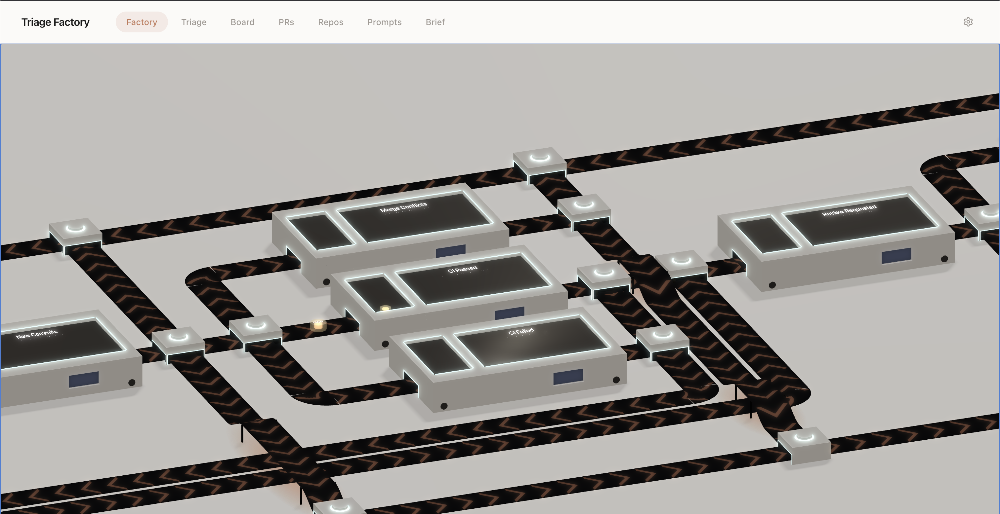

# Triage Factory

<p align="center">
  
</p>

<p align="center">An AI-powered software factory where humans decide what gets automated—and can take over anytime.</p>

<p align="center">
  <a href="https://github.com/sky-ai-eng/triage-factory/releases">
    
  </a>
</p>

Triage Factory tracks everything that needs your attention across GitHub and Jira, scores it with AI, and routes it through an automation engine visualized as a factory floor. In Triage view, swipe to claim, dismiss, snooze, or delegate tasks to Claude. You decide exactly what gets automated, and you can take over any agent's run when needed. The things you delegate get done how you want them done using prompts you write or skills imported from Claude Code. PR reviews, Jira implementations, CI failures, and merge conflict resolution are all handled automatically in isolated worktrees, streaming results to a centralized dashboard in real time.

It runs as a single Go binary on your machine. No hosted service, no team rollout, no DevOps. Credentials live in the OS keychain, and the only things that leave your machine are API calls to GitHub, Jira, and Claude.

## What it does

**Triage queue** — A Tinder-style card stack of everything that needs you. AI scores and ranks items so the most urgent stuff surfaces first. Swipe left (dismiss), right (claim), up (delegate to agent), down (snooze).

**Board** — Three-column kanban (You / Agent / Done) with a collapsible, searchable queue sidebar. Drag tasks between columns. Drag from You to Agent to delegate something you already claimed. The Agent column is attention-weighted: tasks needing your review float to the top, running tasks sink to the bottom.

**Agent delegation** — When you delegate a task, Triage Factory spins up a headless Claude Code instance in an isolated git worktree. The agent works autonomously — reviewing PRs, implementing Jira tickets, resolving merge conflicts, or anything else you can dream up — and streams its activity back to the board in real time. When it's done, you review and approve.

**Prompt routing** — A visual graph editor maps event types to delegation prompts. "Review requested" routes to your PR review prompt, "Jira assigned" routes to your implementation prompt. Drag event types onto prompt nodes to wire them up.

<p align="center">
  
</p>

> Events are **per-action signals** — one event per check completion, one per review submission, one per push. Routing dedups those into one active card per `(entity_id, event_type, dedup_key)` so repeated churn bumps the same work item instead of spawning duplicates. For the current tracked event taxonomy, see [docs/tracked-events.md](docs/tracked-events.md).

**PR dashboard** — Status donut, merge timeline, review balance, and 30-day totals. All your open, merged, and closed PRs in one place. Drag between "Ready for review" and "Drafts" to convert, all while keeping an eye on build status and merge conflicts.

<p align="center">
  
</p>

**Repo profiling** — AI-generated profiles of your configured repos (from README, CLAUDE.md, AGENTS.md) so the scorer and delegation agents understand context without you having to explain it.

## Install

### macOS/Linux — Homebrew (recommended)

```bash
brew tap sky-ai-eng/tap
brew install triagefactory
triagefactory
```

For direct downloads, building from source, prerequisites, and platform-specific notes, see [docs/INSTALLATION.md](docs/INSTALLATION.md).

Similarly, [docs/usage.md](docs/usage.md) details CLI flags, configuration reference, polling details, and delegation/takeover workflows.

## License

[Business Source License 1.1](LICENSE) — free for internal use, converts to Apache 2.0 on 2030-03-31. See [CONTRIBUTING.md](CONTRIBUTING.md) for contribution terms.
